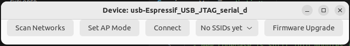
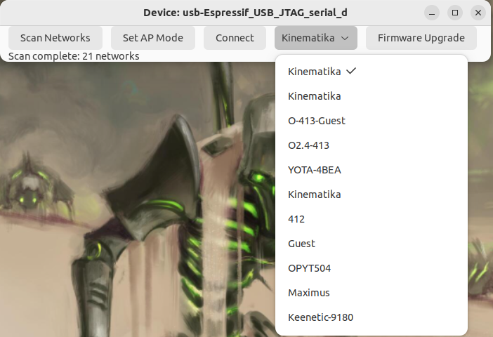
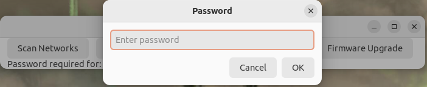
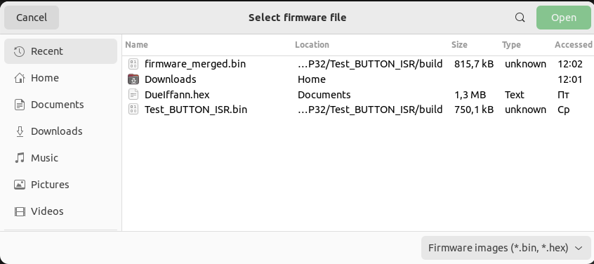

# BalCom1A Configuration Utility

Кроссплатформенная утилита (Windows / Linux) для настройки **модифицированного прибора БалКом‑1А** с модулем **ESP32‑S3 + Wi‑Fi**.

Справка по исходному прибору: https://oookin.ru/balkom1a.htm .

## Что умеет

- Находит устройство по UART (последовательным портам) и показывает базовый статус.
- Сканирует доступные Wi‑Fi сети и позволяет подключить устройство:
  - **AP режим** (устройство поднимает свою точку доступа)
  - **STA режим** (устройство подключается к вашему роутеру)
- Запоминает пароли «известных сетей» локально на компьютере.
- Обновляет прошивку устройства по UART (Firmware Upgrade).

## Как пользоваться

1) Подключите устройство к ПК по USB‑UART.

2) Запустите приложение и дождитесь, пока оно найдёт устройство.

3) Wi‑Fi:
- Нажмите сканирование сетей, выберите SSID.
- Для подключения к роутеру используйте STA режим (введите пароль).
- Для режима точки доступа используйте AP режим.

4) После подключения дождитесь отображения IP:
- `192.168.4.1` означает **Режим точки доступа**.
- Любой другой IP обычно означает **STA режим**.

5) Firmware Upgrade:
- Выберите файл прошивки (merged `.bin`/`.hex`) или файл аргументов `flash_args` из сборки ESP‑IDF.
- Дождитесь завершения операции.
  Примечание: во время прошивки ОС может временно считать приложение «не отвечает»; дождитесь завершения — операция продолжает выполняться.

## Скриншоты

После запуска и подключения устройства по UART вы увидите главное окно и текущий статус:

При сканировании Wi‑Fi появится список найденных сетей (SSID) — выберите нужную:

Далее можно подключить устройство (обычно в STA режим — к вашему роутеру) и при необходимости ввести пароль:

Для обновления прошивки откройте Firmware Upgrade, выберите файл и дождитесь окончания операции:

